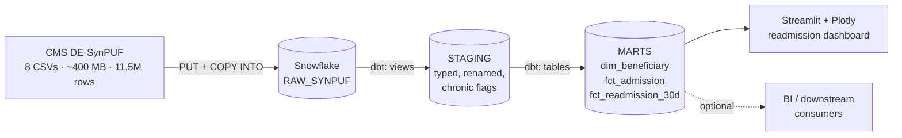
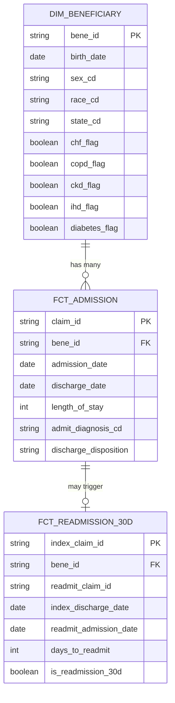

# Medicare Readmission Warehouse

**30-day all-cause readmission analytics on CMS DE-SynPUF synthetic Medicare FFS claims.**
Snowflake · dbt · Streamlit · Kimball-style medallion warehouse.

Nancy Tanaka · [Live demo](#) <!-- VERIFY: replace # with Streamlit Cloud URL once deployed; if not deploying yet, delete this line entirely -->

---

## What this is

A production-pattern data warehouse computing 30-day all-cause readmission rates on CMS DE-SynPUF synthetic Medicare FFS claims. Raw claims land in Snowflake, dbt builds a Kimball-style medallion (raw → staging → marts), and a Streamlit dashboard reads from the gold layer.

The measure is **HEDIS-PCR-adjacent but simplified** — see [What this is *not*](#what-this-is-not) below for the gap to full NCQA HEDIS PCR.

## Headline numbers

CMS DE-SynPUF Sample 1, calendar years 2008–2010:

| Metric                            | Value     |
|-----------------------------------|-----------|
| Index admissions                  | 66,705    |
| Excluded (transfers + overlaps)   | 2,097     |
| Eligible denominator              | 64,608    |
| 30-day readmissions               | 6,420     |
| 30-day all-cause readmission rate | **9.94%** |
| Average days to readmission       | 14.1      |

SynPUF rates run roughly half of real Medicare FFS (~18%) because the source data is synthesized with simplified care patterns. The *measure logic* is portable to real payer claims with no structural changes — only data, masking, and risk-adjustment layers swap in.

---

## Architecture



**Three-layer medallion**, deliberately lean for a single-measure scope:

- **Bronze (RAW_SYNPUF)** — CSVs loaded with `PUT` + `COPY INTO`, schema inferred from headers, zero transformation.
- **Silver (STAGING)** — column rename, `YYYYMMDD` integer → `DATE` casts, CCW chronic indicators cast from `0/1` to booleans. Materialized as views (cheap to rebuild).
- **Gold (MARTS)** — conformed dimensional model, materialized as tables.

## Data model



`fct_admission` is the conformed admission grain (one row per inpatient claim). `fct_readmission_30d` is denormalized for measure consumption — one row per index admission with the readmission flag and days-to-readmit pre-computed.

## Stack

| Layer          | Tool                                                  |
|----------------|-------------------------------------------------------|
| Warehouse      | Snowflake (XS warehouse for builds, X-Small dev)      |
| Transformation | dbt Core 1.8 + `dbt_utils`                            |
| Orchestration  | Manual / cron <!-- VERIFY: change to "Snowflake Tasks" or "Airflow" if you have it -->  |
| Visualization  | Streamlit + Plotly                                    |
| Language       | Python 3.11, SQL                                      |
| Source data    | CMS DE-SynPUF Sample 1 — 8 CSVs, ~400 MB, 11.5M rows  |

## Tests and quality

<!-- VERIFY: run `dbt test` and replace this paragraph with real numbers -->
~30 dbt tests across the project: unique + not_null on every dimension surrogate key and fact grain, referential integrity from `fct_admission.bene_id` to `dim_beneficiary`, accepted-values constraints on coded columns (sex, race, discharge disposition), and custom tests for: (a) admission/discharge date ordering, (b) non-negative length-of-stay, (c) readmission window must be 1–30 days inclusive.

Source freshness checks on the raw layer flag any reload anomalies.

## Cost

<!-- VERIFY: rebuild and capture actual numbers from QUERY_HISTORY or warehouse usage view -->
Full clean rebuild on XS warehouse: ~3 minutes, ~2 credits, ~$6 at on-demand pricing. Incremental staging rebuild + marts rebuild after a single new claim batch: under 1 credit.

## Things worth knowing

These are the design decisions that took non-trivial debugging or thought, in case the SQL alone doesn't tell the story.

**Multi-segment inpatient claims.** A `unique(claim_id)` test failed on 68 claims that had separate revenue-code rows in the source CSV. Staging grain is `(claim_id, segment)`; `fct_admission` collapses back to one row per claim with aggregated charge totals and `min(admission_date)` / `max(discharge_date)` across segments.

**Transfers and overlaps excluded from the denominator.** 2,097 admission pairs had a next admission starting on or before the index discharge date — interfacility transfers and interrupted stays. HEDIS convention treats these as a single episode, so they're excluded from both numerator and denominator. Without this exclusion, the raw rate inflates by ~3 percentage points.

**30-day window measured from discharge, not admission.** Numerator is the next admission on days 1 through 30 after the index discharge date, inclusive. Same-day re-admissions (day 0) are treated as transfers per the previous rule.

**Custom `generate_schema_name` macro.** Default dbt prepends `{target}_` to the configured schema, which would put marts into `STAGING_MARTS` instead of `MARTS`. The macro strips the prefix when a schema is explicitly configured, so `+schema: MARTS` in `dbt_project.yml` lands in `MARTS` cleanly.

**CCW chronic flags accepted as authoritative, not re-derived.** DE-SynPUF's beneficiary summary file ships with CMS Chronic Condition Warehouse pre-computed indicators (`SP_CHF`, `SP_COPD`, `SP_CKD`, `SP_IHD`, `SP_DIABETES`). Staging casts these from `0/1` integers to booleans. The full CCW algorithms (claim-based ICD-9/10 lookback windows over multiple years) are *not* re-implemented here — the SynPUF flags are accepted as ground truth. For a real payer build on raw claims, the CCW algorithm logic would live as a separate intermediate model layer between staging and marts.

## What this is *not*

Honest scope statement so the next reviewer doesn't have to guess.

- **Not full HEDIS PCR.** The NCQA HEDIS Plan All-Cause Readmissions measure additionally requires: age stratification (18–44, 45–54, 55–64, 65–74, 75–84, 85+), planned-readmission exclusion via NCQA's licensed Planned Readmissions Algorithm (CPT/HCPCS code lists), comorbidity risk adjustment via CMS-HCC, and continuous-enrollment denominator criteria. None of those are implemented here. The dimensional grain supports each as additive layers.
- **Not Medicare Advantage.** SynPUF is FFS claims only — no encounter data, no plan attribution, no capitation. The measure pattern transfers; the data layer would need a `dim_plan` and an encounter source for MA-PBP-level reporting.
- **Not ICD-10.** SynPUF predates the 2015 ICD-10 transition. Diagnosis codes are ICD-9-CM. Procedure codes are ICD-9-PCS / HCPCS.
- **Not a re-implementation of CCW chronic algorithms.** See note above.

## What I'd do differently at scale

For a 100M+ annual claim production build:

- Switch staging from views to incremental materialization with a `BENE_ID` cluster key.
- Cluster `fct_admission` on `(BENE_ID, ADMISSION_DATE)` to support beneficiary-history lookbacks.
- Partition the raw load by claim year + claim type and use Snowpipe + streams for continuous ingestion instead of `COPY INTO` batch loads.
- Move the readmission-window join from a self-join to a `LATERAL` subquery — measurably faster on large `fct_admission`.
- Add `query_tag` per dbt model layer for cost attribution and warehouse routing (staging → XS, marts → S, full refresh → M).
- Promote orchestration from manual to Snowflake Tasks (lightweight) or Airflow/Dagster (when external dependencies enter the picture).
- Add a `dbt-expectations` package for distribution-level quality tests in addition to schema tests.

## HIPAA / PHI handling

This pipeline uses **synthetic data** — DE-SynPUF is intentionally PHI-free and CMS publishes it for unrestricted research and prototyping use. No PHI controls are implemented in this repo because none are required for synthetic data.

For a real-PHI build, the controls layer would add:

- Column-level masking on `BENE_ID` (Snowflake `MASKING POLICY`), with role-based unmask for authorized analytics roles.
- Dynamic Data Masking on PII columns (date-of-birth, ZIP, state where re-identification risk applies).
- Network policies restricting warehouse access to enterprise IP ranges + VPN egress.
- Audit logging via `SNOWFLAKE.ACCOUNT_USAGE.ACCESS_HISTORY` with retention and SIEM forwarding.
- Row-access policies if multi-tenant (e.g., separating Cambia BCBS Oregon from BCBS Washington data).
- Customer-managed keys (Tri-Secret Secure) for the warehouse account.
- BAA in place with Snowflake before any PHI lands in the platform.

The dimensional model and the dbt project structure don't change between the synthetic and PHI builds — only the access-control layer and the source-load pattern.

## Run it

Requires Snowflake trial account (free tier is sufficient) and Python 3.11.

```bash
git clone https://github.com/nancytanaka1/medicare-readmission-warehouse
cd medicare-readmission-warehouse

# create virtualenv
python -m venv .venv

# activate (macOS/Linux)
source .venv/bin/activate

# activate (Windows PowerShell)
.venv\Scripts\Activate.ps1

pip install -r requirements-dev.txt
```

Download CMS DE-SynPUF Sample 1 from [CMS](https://www.cms.gov/Research-Statistics-Data-and-Systems/Downloadable-Public-Use-Files/SynPUFs/DE_Syn_PUF) and extract to a local directory. Set the path via environment variable:

```bash
# macOS/Linux
export SYNPUF_DATA_PATH=/path/to/synpuf/sample_01/csv

# Windows PowerShell
$env:SYNPUF_DATA_PATH = "E:\data\synpuf\sample_01\csv"
```

<!-- VERIFY: confirm your scripts actually read SYNPUF_DATA_PATH; if they hardcode the path, either update them or change this section to match -->

Auth setup (key-pair for dev, service account for the Streamlit app) is in [docs/auth-setup.md](docs/auth-setup.md).
Full teardown + rebuild procedure is in [docs/rebuild-from-scratch.md](docs/rebuild-from-scratch.md).

```bash
# load raw layer
snowsql -f sql/01_setup_and_stage.sql
snowsql -f sql/02_load_raw.sql

# build dbt models
cd ma_payer
dbt deps
dbt build

# launch dashboard
streamlit run streamlit/app.py
```

<!-- VERIFY: the `cd ma_payer` line implies your dbt project is named ma_payer/ — if you're renaming the repo, consider renaming this directory too for consistency, or leave it and note it -->

## Roadmap

- [ ] Deploy Streamlit dashboard to Streamlit Community Cloud (live link)
- [ ] Publish `dbt docs` site to GitHub Pages via GitHub Actions
- [ ] Add CI workflow: `dbt build --target ci` on every PR against an isolated Snowflake CI database
- [ ] MA layer: `dim_plan`, beneficiary-to-plan attribution, plan-level readmission rates
- [ ] Add HCC-style risk adjustment overlay (open-source HCC code lists)
- [ ] Implement age-stratified readmission rates per HEDIS PCR submeasures
- [ ] Re-derive CCW chronic flags from claims as a separate intermediate model layer

## License

Apache 2.0 · see [LICENSE](LICENSE).

## Contact

Nancy Tanaka · nancytanaka1@gmail.com · [LinkedIn](#) <!-- VERIFY: paste your LinkedIn URL -->
